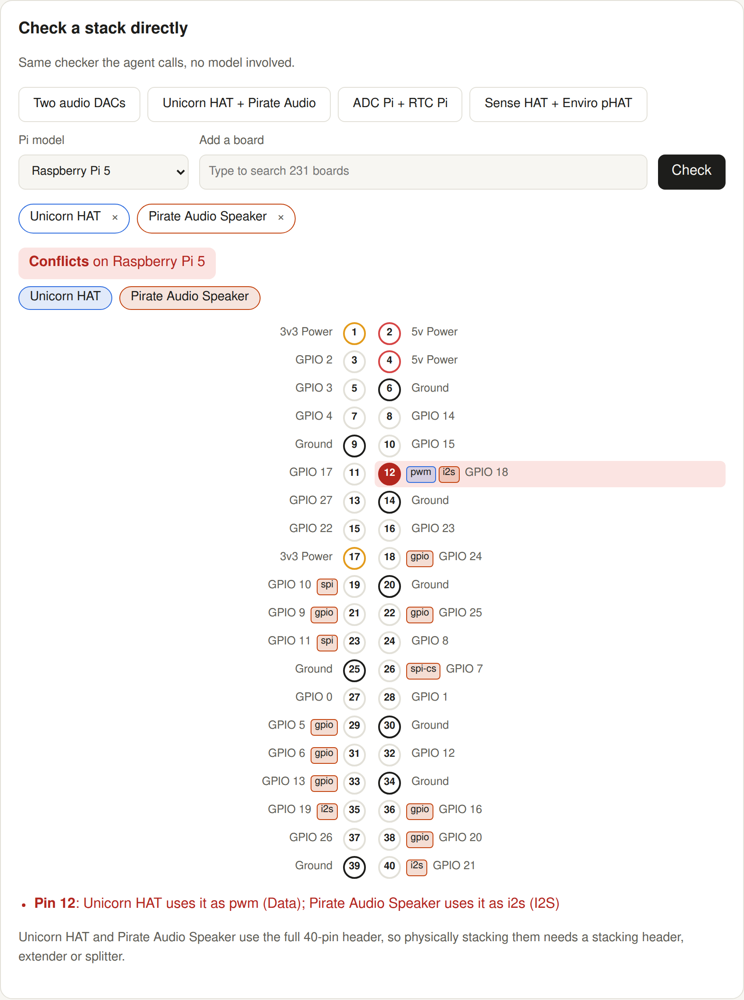
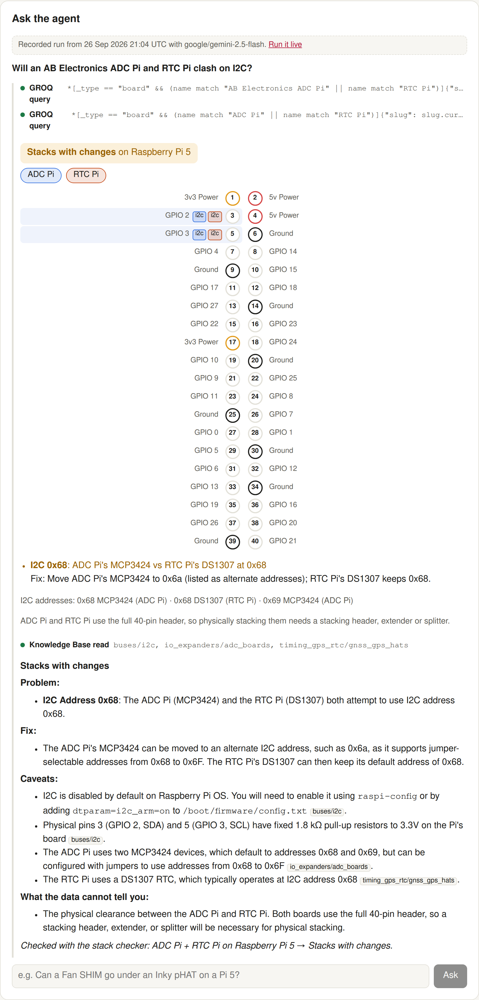

# Will It Stack?

An agent that tells you whether Raspberry Pi add-on boards (HATs, pHATs, bonnets, shims) can share one 40-pin GPIO header, what collides, and what to change.

**Live:** https://will-it-stack.vercel.app · **Sanity project:** `31brl2ka` (public `production` dataset) · Built for the [DEV Sanity Challenge](https://dev.to/challenges/sanity-2026-09-16), Path One.



## How it works

```
question ─► agent (AI SDK, via Vercel AI Gateway)
              ├─ groq_query ──────────► Sanity Context MCP "will-it-stack-data"  (GROQ mode: board/pin/piModel records)
              ├─ check_stack ─────────► lib/stack.ts  (deterministic: pins, I2C addresses, HAT EEPROM, per-SoC pin functions)
              └─ knowledge_base_read ─► Sanity Context MCP "will-it-stack-kb"    (Knowledge Base built from the same dataset)
```

- **Structured records** (`sanity/schema.ts`): 231 `board` documents listing every header pin they touch (with a role such as `i2c`, `spi`, `i2s`, `uart`, `gpio-out`) and every I2C device address (with alternates), 40 `pin` documents with each GPIO's alternate functions per SoC (BCM2835, BCM2711, RP1), 6 `piModel` documents, and 48 `guide` documents of prose.
- **The verdict is code, not the model, and the output fails closed.** `lib/guard.ts` holds the answer text until the run ends. Only the latest `check_stack` call counts (a new call voids the previous result). With no successful check, the visible answer is a fixed "Not verified" message whatever the model wrote. The model's own answer is shown only if its verdict label matches the check, it names every checked board, and it wasn't cut off; it then gets a line naming exactly which boards and Pi were checked. Otherwise the whole answer is replaced by one built from the check report. Once the agent has started using tools, it must keep calling them until a check succeeds. `check_stack` finds pins claimed by two boards for non-shareable roles, I2C address collisions (and whether alternate addresses free them all), multiple HAT ID EEPROMs, and pins asked to do something their SoC can't. Unknown boards make the verdict `incomplete`, never compatible.
- **The Knowledge Base** is built by Sanity Context from 130 documents selected from the dataset (all guides, pins with notes, boards with long descriptions). The agent reads it for fixes and caveats: address jumpers, `dtoverlay` lines, Pi 5 and current Raspberry Pi OS differences, power limits.
- **Check a stack** on the page runs the same checker without a model.



## Evaluation

`scripts/eval.ts` runs ten questions end to end against the live Context MCP endpoints and the model. Ground truth for each stack is the checker itself, so this measures the agent's job, not the checker. Latest run: [`evidence/eval-2026-09-26T2124-google_gemini-2.5-flash.json`](evidence/eval-2026-09-26T2124-google_gemini-2.5-flash.json) (commit `f24fab4`, `google/gemini-2.5-flash`).

| Measure | Result |
|---|---|
| Found the right boards and ran `check_stack` (8 questions naming boards) | 8/8 |
| Verdict label the user sees matches the checker's ground truth | 8/8 |
| The model's own verdict matched its check, before the guard | 7/8 |
| Read the Knowledge Base (8 named-board questions) | 8/8 |
| Citations of a Knowledge Base path the agent didn't read | 0 |
| Off-topic question ("What is a good pizza topping?") | no tool calls; fixed "Not verified" reply |
| Output guard | `ok` 8, `replaced` 1, `unverified` 1 (the off-topic question) |
| Median time and input tokens per question | 13.5 s, 45k |

- The one unfaithful verdict: for Explorer HAT Pro + Unicorn HAT HD on a Pi 4 the model said "Stacks with changes"; the checker says "Stacks", with a warning that both boards carry a HAT ID EEPROM. The guard replaced the model's answer with one built from the check.
- The open-ended question ("Weather station on a Pi 4…") has no single ground truth. The agent picked Enviro Plus + 2.13" E-Paper pHAT and correctly reported their two pin conflicts, but didn't read the Knowledge Base or look for a pair that does stack.
- "Label matches" is label agreement, not proof that every sentence of the answer is right.
- [`evidence/eval-2026-09-26T2012-…json`](evidence/eval-2026-09-26T2012-google_gemini-2.5-flash.json) is an earlier run on older code, kept for the record: it predates the output guard, uses older field names, and five of its ten rows are free-tier gateway errors (rate limits and one internal error).

## Data

| Source | What | License |
|---|---|---|
| [pinout-xyz/Pinout.xyz](https://github.com/pinout-xyz/Pinout.xyz) | board overlays, header pin map, per-SoC pin functions, pin notes | [CC BY-SA 4.0](https://creativecommons.org/licenses/by-sa/4.0/) |
| [raspberrypi/documentation](https://github.com/raspberrypi/documentation) | GPIO, SPI, power, RTC, DPI, RP1, interfaces, Python on Raspberry Pi OS, accessory pages | [CC BY-SA 4.0](https://creativecommons.org/licenses/by-sa/4.0/) |

Every imported document keeps `source.repo`, `source.path` and `source.commit`. The code in this repository is [MIT](LICENSE); the imported data stays [CC BY-SA 4.0](https://creativecommons.org/licenses/by-sa/4.0/), as does anything derived from it (the Knowledge Base entries).

Known upstream data issues handled in `scripts/import.ts`:
- `pi-supply-iot-lora-gateway-hat.md` indents pin 23's `mode: spi` one level too shallow; fixed explicitly.
- Some overlays key pins as `bcm17` rather than a physical number; converted.
- Some overlays name a pin's signal (`I2S`, `TXD / Transmit`) without a `mode`; the role is inferred from the name, but only on that bus's own pins.

## Run it

```sh
npm install
# .env.local: SANITY_CONTEXT_TOKEN (org token, Context Viewer) and AI Gateway auth (VERCEL_OIDC_TOKEN via `vercel env pull`)
npm run dev
npm test                                   # checker tests
node --env-file=.env.local scripts/ask.ts "Can a Fan SHIM go under an Inky pHAT?"
node --env-file=.env.local scripts/eval.ts # end-to-end eval, writes evidence/
```

Re-import the data: `PINOUT_DIR=… RPIDOCS_DIR=… npm run import` (needs a project token with write access).

## Limits

- **Not tested on physical hardware.** Every verdict comes from the pinout.xyz records and the checker in `lib/stack.ts`; nobody plugged these boards in to confirm it.
- It only knows boards that pinout.xyz documents, and only as well as those records are.
- It says nothing about physical clearance, current draw of the boards themselves, or software library conflicts beyond what the Knowledge Base covers.
- For an open question ("what stacks?") it checks one candidate combination; it doesn't search for one that works.
- The live agent is rate-limited: it runs on Vercel AI Gateway's free tier, which allows 5 model requests a minute for the whole account (about one question a minute). The example questions replay recorded real runs of this code (`lib/recorded.json` keeps each run's attempt count and guard status), and the "Check a stack" panel needs no model.

## How this was built

Written with Claude Code (an AI coding agent) working under Anurag Sharma's direction; see the DEV post for the process, including what went wrong.
